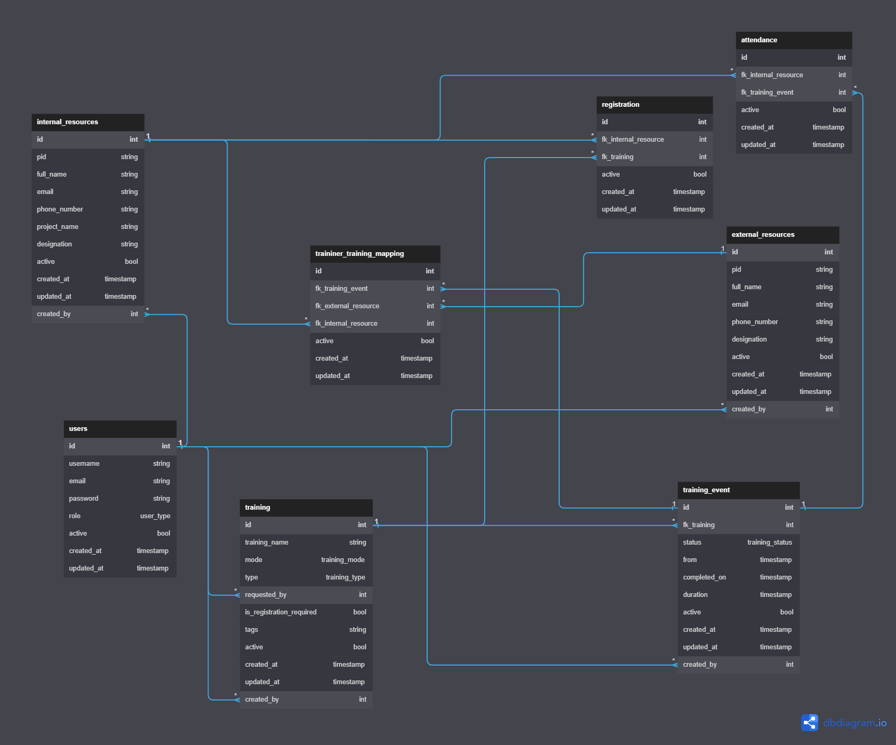

# classroom



- This project created to be used as a starter template.
- Overview
    - Goose to Write MYSQL code with versioning.
        - Create a `<int>_<name>.sql` file. and run goose migrate up. 
        - Goose will run the .sql file and apply changes, In active database.   
        - This way we can keep track of changes to database. 
        - Goose will only run new Files. It keeps track of what files have ran in database table called `goosedb` (**TODO** verify).
    - Custom generated code using go-template, by reading MYSQL, Generate following files
        - By reading Enums
            - Create an `uint16` extended type, by enumName.
            - Create contants by `name`+`type` using `itoa` to have int value starting from 0.
            - Create Methods on extended type, so it will implement   
                -  `graphql.Marshaler` -> So that enum can be Marshal and UnMarshal by gqlgen from Graphql query.
                -  `sql/driver.Valuer` and `database/sql.Scanner` -> So that 'repository' can perform *Insert* and *Select* Operations on the enum column.


## Backend 

- **SQL first architecture and Goose:** 
    - Hello


- **Go Mod:**
    - As go mod uses direct URLs. And we are using our own library `xo`, <br> Each time we update `xo` we have to push it to github, so that `backend` can `go mod tidy` lattest version. 
    - Above problem is solved by adding following in go.mod file. <br>
      So that we are pointing to local files, so go mod does not query the web. 
    ```
        replace github.com/ketan-10/classroom/xo => /home/ketan/go/src/classroom/xo
    ```
